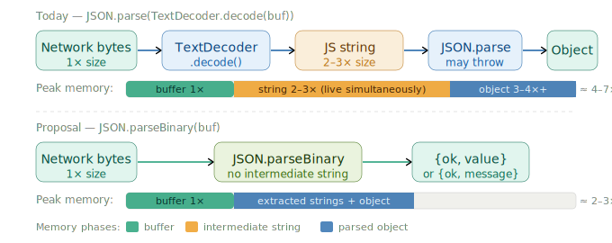

# JSON.parseBinary

## Status

Author: Daniel Dyryl \<diril656@gmail.com\>

Stage: 0

## Want to summarise information below?
[Look at the overview.md](./overview.md)

This proposal is oriented on performance improvements. Not 10X faster, but visible under load.

All benchmarking results mentioned here are publicly available in GitHub Actions of this current repo.

## Problem

Every JSON parsing operation in a JavaScript HTTP server / HTTP request (like Fetch API) follows this pipeline:
```
network bytes (ArrayBuffer / Uint8Array)
  → string = TextDecoder.decode()   — allocates a new JS string
  → JSON.parse(string)              — parses, throws SyntaxError on failure
  → object
```
Both steps carry hidden costs that compound at scale.

### SyntaxError

An `Error` instance in JavaScript generates a stack trace with significant overhead — solely for debugging. But in the context of network requests we cannot force the correctness of the payload, so we have nothing to debug. `SyntaxError` provides no advantage over a simple string message, yet consumes more memory and CPU time to generate.

Throwing also forces inconvenient `try-catch` blocks. Nested throwing functionality requires nested `try-catch` blocks to handle multiple failure modes.

Instead we can return an object like `{ok: true, value}` or `{ok: false, message}` and optimise our handler for untrusted inputs.

---

Results of [Errors benchmark](./demo/errors.mjs) — 1M iterations:

```
{ ok: false, message }      ░░░░░░░░░░░░░░░░░░░░░░░░░░░░       3.7 ms
new SyntaxError(message)    ██████████████████████░░░░░░    2206.6 ms
throw new SyntaxError()     ████████████████████████████    2793.4 ms
```

`SyntaxError` construction is ~600× more expensive than a plain object. Throwing adds another ~27% on top of that.

### Intermediate string

When we receive a 1× payload and decode it we have 2× (UTF-8 if Latin chars) to 3× (UTF-16 if any multi-byte chars) of the payload size in memory — held for microseconds with increased GC pressure.

The payload may be malformed, but to discover this we must incrementally parse it — the job of `JSON.parse`. We would rather skip the intermediate string entirely, identify problems early and protect the application under high load. And this is totally doable, as according to [RFC 8259](https://datatracker.ietf.org/doc/html/rfc8259#section-8.1), JSON messages MUST be UTF-8

Even if there is only one UTF-16 char in the string, it becomes twice as large in any case. If strings were parsed only one by one and inserted into the resulting structure, it would have MOST of the data UTF-8 and one 1 string UTF-16. This HUGELY improves performance of i18n services.


---

#### [Decoding benchmark](./demo/decoding.mjs) — 4 MB symbols, 100 iterations:

```
input                 JS chars   UTF-8 bytes   ratio  V8 string encoding
────────────────────────────────────────────────────────────────────────────
A (ascii)          4,194,304     4,194,304     1.00×  Latin-1  (1 byte/char)
A…👎🏿 (mixed)       4,194,308     4,194,312     1.00×  UTF-16   (2 bytes/char) — one emoji forces full upgrade
☺️ (3-byte)        8,388,608    25,165,824     3.00×  UTF-16   (2 bytes/char)
👎🏿 (4-byte)       16,777,216    33,554,432     2.00×  UTF-16   (4 bytes/char, 2 surrogates)

A        (1-byte UTF-8)   ░░░░░░░░░░░░░░░░░░░░░░░░░░░░     187.1 ms
A…👎🏿    (1-byte + emoji)  █░░░░░░░░░░░░░░░░░░░░░░░░░░░     303.2 ms  1.6× slower — UTF-16 upgrade
☺️       (3-byte UTF-8)   █████████████████████░░░░░░░   11143.3 ms  UTF-8 buf 6.0× larger than ASCII buf
👎🏿       (4-byte UTF-8)   ████████████████████████████   14703.5 ms  78.6× slower than ASCII
```

---

#### [Parsing benchmark](./demo/json-parse.mjs):

```
────────────────────────────────────────────────────────────────────
  json-parse  small payload · 512 B
────────────────────────────────────────────────────────────────────

  Payload size:  0.5 KB
  Iterations:    300,000

  valid  (no try-catch)       ███████████░░░░░░░░░░░░░░░░░     777.0 ms
  invalid, error@start        ████████████████████████████    1983.1 ms  2.55× slower than valid

  SyntaxError cost:     155%  over valid parse

────────────────────────────────────────────────────────────────────
  json-parse  large payload · 4 MB
────────────────────────────────────────────────────────────────────

  Payload size:  4.0 MB
  Iterations:    only 300 — a thousand times less than 'small' case

  valid  (string)             ████████████████████████░░░░    7539.8 ms
  invalid, error@start        ░░░░░░░░░░░░░░░░░░░░░░░░░░░░       3.6 ms  O(1) abort — 0.05% of valid parse time
  invalid, error@end          ████████████████████████████    8765.8 ms  16% slower than valid
  + TextDecoder               ████████████████████████████    8737.0 ms  +15.9% over string parse
  wasted decode, err@start    ██░░░░░░░░░░░░░░░░░░░░░░░░░░     645.0 ms  +15.9% over string parse
  + Buffer.str()              ████████████████████████████    8725.3 ms  +15.7% over string parse

  large error@start ~ small error@start = 0.04% of error@end time
  Full-walk penalty:    error@end   = 16% over valid parse
  TextDecoder cost:     decode+parse = 15.9% over string parse
  Buffer cost:          str+parse    = 15.7% over string parse

  In the "wasted decode" case: 641.4ms of extra work per 300 iterations —
  more than 2ms per request — with no benefit whatsoever when the payload
  is invalid at byte 0.
```

#### [Memory usage + GC overhead](./demo/gc-strings.mjs)

```
 Payload size            5 MB
────────────────────────────────────────────────────────────────────
  Wall time  2,000 decode iterations
────────────────────────────────────────────────────────────────────
  1) heap: unconstrained
  ASCII (Latin-1 path)        ████████████░░░░░░░░░░░░░░░░  5232.221 ms
  Mixed (UTF-16 upgrade)      ████████████████████░░░░░░░░  8510.069 ms  1.63× slower

  2) heap: 25MB cap
  ASCII (Latin-1 path)        ███████████████░░░░░░░░░░░░░  6546.614 ms
  Mixed (UTF-16 upgrade)      ██████████████████████████░░  10991.535 ms  1.68× slower

  Scale: 12,000 ms. Fixed across runs for comparison.
  One emoji near the end forces V8 to re-encode the entire string mid-decode.
────────────────────────────────────────────────────────────────────
  Heap retained at handler exit, last string still live, no GC yet
────────────────────────────────────────────────────────────────────
  1) heap: unconstrained
  ASCII  heap before      3.8 MB
  ASCII  heap at exit     68 MB
  ASCII  string retained  ~64.2 MB

  Mixed  heap before      3 MB
  Mixed  heap at exit     123 MB
  Mixed  string retained  120 MB
  ··································································
  ASCII  peak heap            ███████████████░░░░░░░░░░░░░  68MB
  Mixed  peak heap            ███████████████████████████░  123MB


  2) heap: 25MB cap
  SCII  heap before      3.8 MB
  ASCII  heap at exit     23 MB
  ASCII  string retained  ~19.2 MB
  Mixed  heap before      3 MB
  Mixed  heap at exit     23 MB
  Mixed  string retained  20 MB
  ··································································
  ASCII  peak heap            █████░░░░░░░░░░░░░░░░░░░░░░░  23MB
  Mixed  peak heap            █████░░░░░░░░░░░░░░░░░░░░░░░  23MB

  Scale: 128 MB. Fixed across runs — bars are directly comparable.
  In production memory limit is usually increased rather than decreased,
  but here that results into 100MB+ of unused memory, polluting V8 and 
  slowing down whole OS, no just JS process

────────────────────────────────────────────────────────────────────
  After explicit GC
────────────────────────────────────────────────────────────────────
  1) heap: unconstrained
  ASCII  heap after GC    8 MB
  ASCII  freed by GC      60 MB

  Mixed  heap after GC    13 MB
  Mixed  freed by GC      110 MB

  
  2) heap: 25MB cap
  ASCII  heap after GC    8 MB
  ASCII  freed by GC      15 MB
  Mixed  heap after GC    13 MB
  Mixed  freed by GC      10 MB

  global.gc() is never called in a production server.
  Under sustained load the 120 MB retained per request in standard 
  environment accumulates until V8 is forced into a stop-the-world
  collection.

────────────────────────────────────────────────────────────────────
  Summary
────────────────────────────────────────────────────────────────────
  1) heap: unconstrained
  ASCII retained/request  ~64.2 MB  — might be 0, might be more
  Mixed retained/request  120 MB  — old-gen, survives to stop-the-world
  Peak heap ratio         1.8×  (mixed vs ASCII)
  Wall time ratio         1.63×  (mixed vs ASCII)

  2) heap: 25MB cap
  ASCII retained/request  ~19.2 MB  — might be 0, might be more
  Mixed retained/request  20 MB  — old-gen, survives to stop-the-world
  Peak heap ratio         1.0×  (mixed vs ASCII)
  Wall time ratio         1.68×  (mixed vs ASCII)


  A 5 MB payload with one emoji forces a UTF-16 string that retains
  120MB in normal environments and up to 20MB in experimental 
  environment with 25MB cap, which is impractical.

  JSON.parseBinary avoids this: no intermediate string is allocated.
```

### Initial buffer stays in memory

We receive 1× payload as binary, convert to string (2–3×), parse to JSON (3–4×+), but the original buffer never gets cleared.

If we receive it as a callback parameter, it cannot even be marked for GC — a live reference outside persists. Under high load memory can reach its ceiling and V8 will "stop the world" to clear all unreferenced memory. To solve this, see the companion proposal — [ArrayBuffer.prototype.detach()](https://github.com/Guthib-of-Dan/proposal-arraybuffer-detach).

### Global TextDecoder / Buffer.from() pollution

To operate on `ArrayBuffer` today we must either pollute the module scope with a `TextDecoder` instance, or create a temporary view like `Buffer.from(buffer)` in Node.js to call `.toString()`. Both patterns add GC pressure.

## Idea

Introduce `JSON.parseBinary` — a new static method that accepts a `Uint8Array` or `ArrayBuffer | SharedArrayBuffer` and returns a result object rather than throwing.

### TypeScript declaration

```typescript
interface JSON {
    stringify( ... ): string;
    parse( ... ): any;
    /**
     * Converts untrusted binary input into a JavaScript value.
     * @param input binary buffer supposedly containing JSON data.
     */
    parseBinary(input: ArrayBufferLike | Uint8Array):
        { ok: true; value: any } |
        { ok: false; message: string }
}
```
`JSON.parseBinary` accepts SharedArrayBuffer and parses it as an ordinary one, without any "copying for the sake of atomicity".

## What changes

### Pipeline of network bytes


### [Click to see all examples](./examples/)

### Fetch API — before

```typescript
var decoder = new TextDecoder(); // pollutes module scope

async function requestEndpointA() {
    let body: ArrayBuffer;
    try {
        body = await fetch(SOME_LINK).then(res => res.arrayBuffer());
    } catch (err) {
        // handle fetch error
    }
    // GC pressure++; wasted if body is invalid
    const intermediateString = decoder.decode(body);
    let result: object;
    try {
        result = JSON.parse(intermediateString);
    } catch (err) {
        const message = (err as SyntaxError).message;
        // log the message
    }
    // process result
}
```

### Fetch API — after

```typescript
async function requestEndpointA() {
    let body: ArrayBuffer;
    try {
        body = await fetch(LINK).then(res => res.arrayBuffer());
    } catch (err) {
        // handle fetch error
    }
    // no TextDecoder, no intermediate string, no try-catch
    const parseResult = JSON.parseBinary(body);
    if (!parseResult.ok) {
        // log parseResult.message and quit
        return;
    }
    const result = parseResult.value;
    // process result
}
```

### node:http
This example doesn't use Buffer.concat, because it is less efficient overall, copies all buffers into
one while all chunks are alive  leading to 2X payload size simultaneously + individual chunks stay longer in memory,
because they would be kept until the end as an array for "concat"
#### Before

```javascript
server.on('request', async (req, res) => {
  body = Buffer.allocUnsafe(Number(req.headers["content-length"]));
  var offset = 0;
  await new Promise((resolve) => {
    req.on("data", (chunk) => {
      body.set(chunk, offset);
      offset += chunk.byteLength;
    })
    req.once("end", resolve)
  })

  let result;
  try {
    result = JSON.parse(body.toString());
  } catch (err) {
    res.writeHead(400).end(err.message);
    return;
  }
  // mark for GC
  body = undefined;

  // body sits in memory until GC decides to collect it
  handleResult(result);
});
```

#### After
```javascript
server.on('request', async (req, res) => {
  // memory-mapped buffer, doesn't consume whole memory when initialised.
  const body = Buffer.allocUnsafeSlow(Number(req.headers["content-length"]));
  var offset = 0;
  await new Promise((resolve) => {
    req.on("data", (chunk) => {
      // write to memory-mapped data (activate partially) and detach immediately
      body.set(chunk, offset);
      offset += chunk.byteLength;
      // co-proposal, clears memory manually
      chunk.buffer.detach();
    })
    req.once("end", resolve)
  })

  const parseResult = JSON.parseBinary(body);

  // co-proposal, clear body after parsing
  body.buffer.detach();

  if (!parseResult.ok) {
    res.writeHead(400).end(parseResult.message);
    return;
  }
  handleResult(parseResult.value);
});
```
---

## Relation to other proposals / discussions
- [Comment inside NodeJS's codebase](https://github.com/nodejs/node/blob/main/lib/querystring.js#L472)
  tells that try-catch blocks are not optimised up to V8 5.4 and still are not inlined, hurting performance.
- [Stack Overflow discussion](https://stackoverflow.com/questions/29797946/handling-bad-json-parse-in-node-safely)
  shows that unnecessary SyntaxError is a concern
- [Memory leak in JSON.parse](https://github.com/nodejs/node/issues/35048) was resolved 6 years ago, but it used to occure only after invalid payload, which JSON.parseBinary is intended to be optimised for
- [GitHub gist on `Error`](https://gist.github.com/thlorenz/1e534d5c4c58a84ea40a) mentions 450x performance penalty because of stack trace generation
- [secure-json-parse by Fastify](https://github.com/fastify/secure-json-parse) exposes `safeParse` method, which cleverly "mutes" stack trace with `Error.stackTraceLimit = 0` call, surpassing all alternatives when parsing potentially invalid payloads. However, it deoptimises successful path and `throw + try-catch` problem still persists. `JSON.parseBinary` addresses relevant issues in a right way and is a [viable upgrade for various frameworks/tools](https://github.com/fastify/fastify/discussions/6625)
- [Decoding/encoding discussion](https://github.com/whatwg/encoding/issues/343) mentioned the poor performance of TextDecoder and TextEncoder WHATWG APIs, compared to JS manual implementations and `node:buffer Buffer.toString() Buffer.from()`. In particular, this touches (node-fetch)[https://github.com/node-fetch/node-fetch/blob/8b3320d2a7c07bce4afc6b2bf6c3bbddda85b01f/src/body.js#L147], as it uses TextDecoder.
- [JSON.rawJSON](https://developer.mozilla.org/en-US/docs/Web/JavaScript/Reference/Global_Objects/JSON/rawJSON), documentation of which was last updated in July 2025, proves that `JSON.*` API is not sealed for extension, as some people were speculating. If `rawJSON` and `isRawJSON` appeared, `parseBinary` can as well.
- [This NodeJS discussion](https://github.com/nodejs/node-v0.x-archive/issues/7543#issuecomment-44143636) has already reached certain conclusion that parsing JSON straight from utf-8 buffer is faster and not that harder.
- [This commit in i-json parser](https://github.com/bjouhier/i-json/commit/090d7be4db670e28923e75976fdd9cfc356bfeba) shows, that implementation can parse raw Buffer, so the implementation, which skipped intermediate strings, DID exist. Furthermore, based on [this comment](https://github.com/nodejs/node-v0.x-archive/issues/7543#issuecomment-44471279), parser would be faster, if was native within V8.

## Design decisions ("why not X")

This section addresses specific alternative designs raised during community review. Each alternative was considered carefully; the choices below keep `JSON.parseBinary` a **single-purpose, synchronous, non-destructive** utility.

---

### Why not detach the buffer internally?

Short answer: because it makes `JSON.parseBinary` a framework, not a utility.

If the method detached the buffer on your behalf, it would silently take ownership of your memory — tying the caller's architecture to a specific ownership model with no opt-out. A developer who still needs the buffer after parsing (to log it, inspect it, pass it elsewhere) would have no recourse.

The proposals are intentionally separated. `JSON.parseBinary` parses. `ArrayBuffer.prototype.detach()` releases memory. You compose them as your application requires:

```javascript
// parse first, detach when you know you're done
const result = JSON.parseBinary(buffer);
if (!result.ok) {
    console.error('bad payload', buffer.byteLength); // buffer still accessible
    buffer.detach();
    return;
}
buffer.detach(); // done with raw bytes
// process result.value
```

If you want a one-liner that does both, write a local wrapper. Proposing that wrapper as a global is what gets proposals cancelled.

---

### Why not an explicit transfer list like `postMessage`?

Suggested shape: `JSON.parseBinary(buffer, [buffer])` — parse and detach in one atomic call, similar to `postMessage(data, [transfer])`.

This creates a dilemma on failure. After a transfer, the buffer is detached regardless of outcome. There are only two paths:

- **Don't detach on error** — confuses developers, since the transfer list implies detachment.
- **Detach on error and return `input` in the result** — creates another view on that memory chunk (avoid initial detached buffer), adds more GC pressure, and returns that buffer as an object property. So if initial buffer gets cleared by JSON.parseBinary, who clears "input" buffer then? Back to square one.

```javascript
// with transfer list — who clears result.input?
const result = JSON.parseBinary(buffer, [buffer]);
if (!result.ok) {
    console.log('bad', result.input.buffer.byteLength);
    result.input.buffer.detach(); // back to square one
    return;
}
// handle result.value

//----------------------------//

// without transfer list — you have full control
const result = JSON.parseBinary(buffer);
if (!result.ok) {
    console.log('bad', buffer.byteLength); // buffer still yours
    buffer.detach();
    return;
}
buffer.detach();
// handle result.value
```

The second form is strictly cleaner. Adding a transfer list gives the illusion of convenience while removing developer freedom.

---

### Why not streaming parser or an async non-blocking variant?

This discussion lasts at least twelve years, but [you can click here to see the formed answer](./why-not-stream-or-async-json.md)

### Why not add a `reviver` like in JSON.parse?
In the [benchmarks](https://github.com/fastify/secure-json-parse?tab=readme-ov-file#benchmarks), conducted by `secure-json-parse`, reviver inflicted huge slowdowns. Apart from being easily replacable, each call creates another scope, handles another V8 Isolate - impractical for frequent usage.

### Why extend `JSON.*` and not create new API like `new JSONDecoder().decode(buf)`
JSON.rawJSON proves that JSON.* api is not sealed, contrary to a popular belief.

## Relation to `ArrayBuffer.prototype.detach()`

`JSON.parseBinary` does not detach any buffer. If you want immediate release of the backing store after parsing, call `.detach()` yourself:

```javascript
const result = JSON.parseBinary(buffer);
buffer.detach(); // backing store released, buffer is now zero-length
if (!result.ok) return;
// process result.value — the parsed object has no reference to the buffer
```

See [proposal-arraybuffer-detach](https://github.com/Guthib-of-Dan/proposal-arraybuffer-detach) for the companion proposal.
